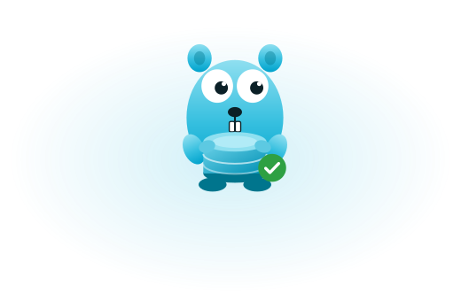

<div align="center">



# orm

**You own your structs. PostgreSQL owns your schema. The generator proves they agree.**

[](https://pkg.go.dev/github.com/AlexAli29/orm)
[](go.mod)
[](docs/compatibility.md)
[](https://github.com/AlexAli29/orm/actions/workflows/ci.yml)
[](LICENSE)

**[Documentation](https://ormgo.vercel.app)** · [Quickstart](https://ormgo.vercel.app/en/docs/quickstart/) · [Документация на русском](https://ormgo.vercel.app/ru)

</div>

---

Most Go data-access tools pick a side. An ORM generates the schema from the
structs and turns your database into an implementation detail. A query compiler
generates the structs from the schema and turns your domain model into a
transcript of `information_schema`.

This does neither. You write the structs, something authoritative owns the schema
— your existing database, or migration files you reviewed — and `orm check`
introspects both and reports every place they disagree. Once the mapping is
proven, `orm generate` writes typed metadata from it, and that metadata is what
makes queries type-safe without reflection.

## Install

```console
$ go get github.com/AlexAli29/orm
$ go install github.com/AlexAli29/orm/cmd/orm@latest
```

Go 1.24 and PostgreSQL 14 or newer. The only runtime dependency is
[pgx](https://github.com/jackc/pgx).

## Use

```console
$ orm init      # write orm.yaml
$ orm check     # reconcile the structs against the real schema
$ orm generate  # write typed metadata from what was proven
```

`generate` runs the same reconciliation `check` does and refuses to write
anything if it does not hold. When they disagree it says where, in your source:

```console
$ orm check
internal/domain/user.go:12:2: error: E004: nullable column public.users.nickname cannot be represented by string
    Go:          domain.User.Nickname string
    PostgreSQL:  public.users.nickname text
    reason:      string has no value that means SQL NULL
    fix:         use *string, or sql.Null[string]
```

Then the queries are ordinary Go, checked by the compiler:

```go
users, err := db.Users.Query().
    Where(Users.Active.Eq(true)).
    Where(Users.Email.Like("%@example.com")).
    OrderBy(Users.CreatedAt.Desc()).
    Limit(20).
    All(ctx)
```

`Users.Active.Eq("yes")` does not compile. Neither does ordering by a column
whose type PostgreSQL cannot order, or binding a nullable column to a
destination that cannot hold NULL.

## What you get

- 🧭 **Reconciliation, not migration** — nothing touches your schema implicitly, and there is no DDL at run time
- 🔒 **Type-safe dynamic queries** — filters composed at run time, checked at compile time, with no reflection on the row path
- 🧱 **Real PostgreSQL** — `LATERAL`, CTEs, `UNION ALL`, window functions, ranges, JSONB, full-text search, arrays, enums, composites
- 🗺️ **[PostGIS](https://ormgo.vercel.app/en/docs/postgis/)** — geometry and geography kept apart, SRIDs carried through
- 🔗 **Explicit relations** — no lazy loading, so a loop cannot quietly become N queries
- ✍️ **Stated writes** — `Insert`, `Update`, `Delete`, `RETURNING`; no identity map, no dirty tracking, no `Save`
- 🧪 **[Testing helpers](https://ormgo.vercel.app/en/docs/testing/)** and **[OpenTelemetry](https://ormgo.vercel.app/en/docs/observability/)** as separate modules you opt into
- 🤖 **[Agent-readable docs](https://ormgo.vercel.app/en/docs/agents/)** — `llms.txt` and a generated manifest of every exported symbol

## What it is not

- **PostgreSQL only.** Not a portable abstraction over four databases.
- **No `AUTO MIGRATE`.** [Managed mode](docs/migrations.md) writes migration files you read and apply on purpose.
- **No lazy loading, no identity map, no dirty tracking, no cascades, no hooks, no second-level cache.**
- **No hidden zero-value semantics.** `Active: false` stores `false`.

## Documentation

The [documentation site](https://ormgo.vercel.app) is the place to start — every
feature, in English and Russian, with worked examples.

The long-form manual that used to live in this file is [`docs/manual.md`](docs/manual.md).
Beside it: [compatibility](docs/compatibility.md), [migrations](docs/migrations.md),
[performance](docs/performance.md), [production](docs/production.md) and
[extensions](docs/extensions.md).

## Proven against

PostgreSQL 14, 15, 16, 17 and 18, on every push. Generated artifacts are
byte-identical across all five, and the suite fails rather than skips when a
server is missing — a support claim nothing exercises is a claim nobody should
believe.

## License

MIT. See [LICENSE](LICENSE).

<div align="center">
<sub>The gopher was drawn for this project, in the spirit of the Go gopher — the original character is Renée French's, CC BY 3.0.</sub>
</div>
